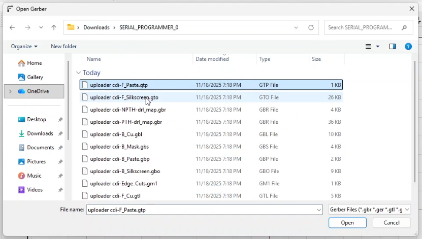

# Perkenalan 
ini adalah repository untuk dokumentasi proses pembuatan pcb menggunakan cnc untuk drilling, laser untuk membuat jalur, dan etching kimia untuk ekspos jalur yang terpakai dan tidak terpakai.

## persiapan
1. install semua software yang diperlukan
   1. flatcam untuk membuat cam titik pengeboran lubang mesin cnc desktop
   2. universal gcode sender yang dapat diinstall disini [UGS_Download](https://github.com/winder/Universal-G-Code-Sender/releases/tag/v2.1.17)
   3. excad2 beserta driver mesin laser untuk mengirim dan mengontrol perintah ke mesin laser 
2. persiapkan file pcb yang ingin dibuat, misalkan saya memiliki file seperti ini (file pcb output dari kicad)

3. setelah file dipersiapkan, buka aplikasi flatcam dan mulai melakukan cam pcb yang diperlukan. misalkan duplikat pcb agar dalam satu kali batch dapat membuat banyak pcb sekaligus, menambah lubang di pojok-pojok pcb sebagai titik utama laser, dan membuat file svg sebegai pola yang akan dilaser
4. setelah melakukan cam, buat file .nc untuk melubangi pcb menggunakan cnc 
5. persiapkan bahan-bahan yang dibutuhkan. contohnya seperti pcb yang sudah dipilok hitam, larutan hcl dan h2o2, solasi m3 double tape, dan wadah untuk melakukan etching.
6. mulai proses melubangi pcb menggunakan cnc dengan menggunakan aplikasi universal gcode sender. hal-hal yang perlu diperhatikan diantaranya adalah titik nol, arah peletakan pcb, peletakan pcb pada bed, dan lubang pcb yang tembus pcb-nya ketika sudah di bor dengan cnc desktop
7. setelah melubangi, 